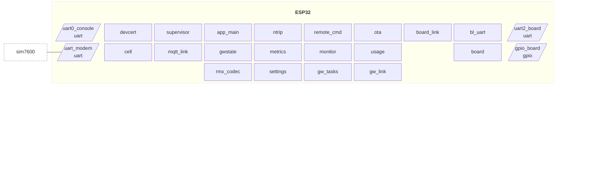
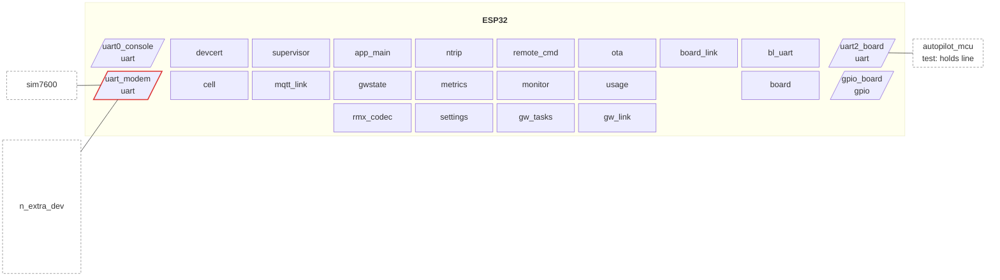

# Block layout prototype

## 1. gateway as is (processor ESP32)

```mermaid
block-beta
  columns 12
  block:left
    columns 1
    space
    space
    n_sim7600["sim7600"]
    space
  end
  block:chip:10
    columns 10
    chip_title["<b>ESP32</b>"]:10
    n_uart0_console[/"uart0_console<br/>uart"/]
    n_devcert["devcert"]
    n_supervisor["supervisor"]
    n_app_main["app_main"]
    n_ntrip["ntrip"]
    n_remote_cmd["remote_cmd"]
    n_ota["ota"]
    n_board_link["board_link"]
    n_bl_uart["bl_uart"]
    n_uart2_board[/"uart2_board<br/>uart"/]
    n_uart_modem[/"uart_modem<br/>uart"/]
    n_cell["cell"]
    n_mqtt_link["mqtt_link"]
    n_gwstate["gwstate"]
    n_metrics["metrics"]
    n_monitor["monitor"]
    n_usage["usage"]
    space
    n_board["board"]
    n_gpio_board[/"gpio_board<br/>gpio"/]
    space
    space
    space
    n_rmx_codec["rmx_codec"]
    n_settings["settings"]
    n_gw_tasks["gw_tasks"]
    n_gw_link["gw_link"]
    space
    space
    space
  end
  block:right
    columns 1
    space
    space
    space
    space
  end
  style left fill:none,stroke:none
  style right fill:none,stroke:none
  n_uart_modem --- n_sim7600
  classDef title fill:none,stroke:none
  classDef device fill:none,stroke:#888,stroke-dasharray:4 3
  class chip_title title
  class n_sim7600 device
```

## 2. test only: fake devices (right side, shared bus)

```mermaid
block-beta
  columns 12
  block:left
    columns 1
    space
    space
    n_sim7600["sim7600"]
    space
  end
  block:chip:10
    columns 10
    chip_title["<b>ESP32</b>"]:10
    n_uart0_console[/"uart0_console<br/>uart"/]
    n_devcert["devcert"]
    n_supervisor["supervisor"]
    n_app_main["app_main"]
    n_ntrip["ntrip"]
    n_remote_cmd["remote_cmd"]
    n_ota["ota"]
    n_board_link["board_link"]
    n_bl_uart["bl_uart"]
    n_uart2_board[/"uart2_board<br/>uart"/]
    n_uart_modem[/"uart_modem<br/>uart"/]
    n_cell["cell"]
    n_mqtt_link["mqtt_link"]
    n_gwstate["gwstate"]
    n_metrics["metrics"]
    n_monitor["monitor"]
    n_usage["usage"]
    space
    n_board["board"]
    n_gpio_board[/"gpio_board<br/>gpio"/]
    space
    space
    space
    n_rmx_codec["rmx_codec"]
    n_settings["settings"]
    n_gw_tasks["gw_tasks"]
    n_gw_link["gw_link"]
    space
    space
    space
  end
  block:right
    columns 1
    space
    n_autopilot_mcu["autopilot_mcu<br/>test: holds line"]
    space
    space
  end
  style left fill:none,stroke:none
  style right fill:none,stroke:none
  n_uart_modem --- n_sim7600
  n_uart2_board --- n_autopilot_mcu
  n_uart_modem --- n_extra_dev
  classDef title fill:none,stroke:none
  classDef device fill:none,stroke:#888,stroke-dasharray:4 3
  class chip_title title
  class n_sim7600,n_autopilot_mcu,n_extra_dev device
  classDef shared stroke:#d33,stroke-width:2px
  class n_uart_modem shared
```
