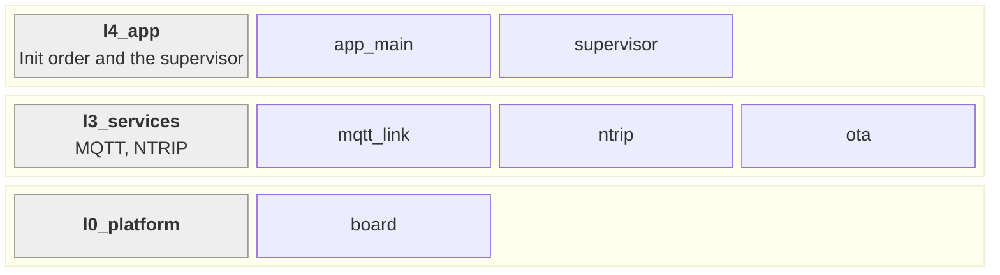

# probe

```mermaid
block-beta
  columns 1
  block:r_l4
    columns 4
    t_l4["<b>l4_app</b><br/>Init order and the supervisor"] n_app_main["app_main"] n_supervisor["supervisor"] space
  end
  block:r_l3
    columns 4
    t_l3["<b>l3_services</b><br/>MQTT, NTRIP"] n_mqtt_link["mqtt_link"] n_ntrip["ntrip"] n_ota["ota"]
  end
  block:r_l0
    columns 4
    t_l0["<b>l0_platform</b>"] n_board["board"] space space
  end
  classDef layer fill:#eee,stroke:#999
  class t_l4,t_l3,t_l0 layer
```
