# Mermaid diagram types on GitHub

Scratch test, one example per type (official 12.3.0 docs examples).

## flowchart

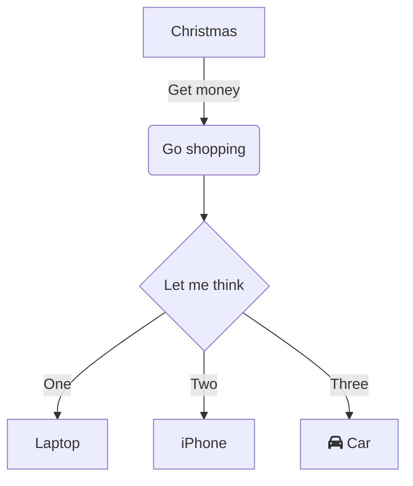
```mermaid
flowchart TD
    A[Christmas] -->|Get money| B(Go shopping)
    B --> C{Let me think}
    C -->|One| D[Laptop]
    C -->|Two| E[iPhone]
    C -->|Three| F[fa:fa-car Car]
```

## C4Context

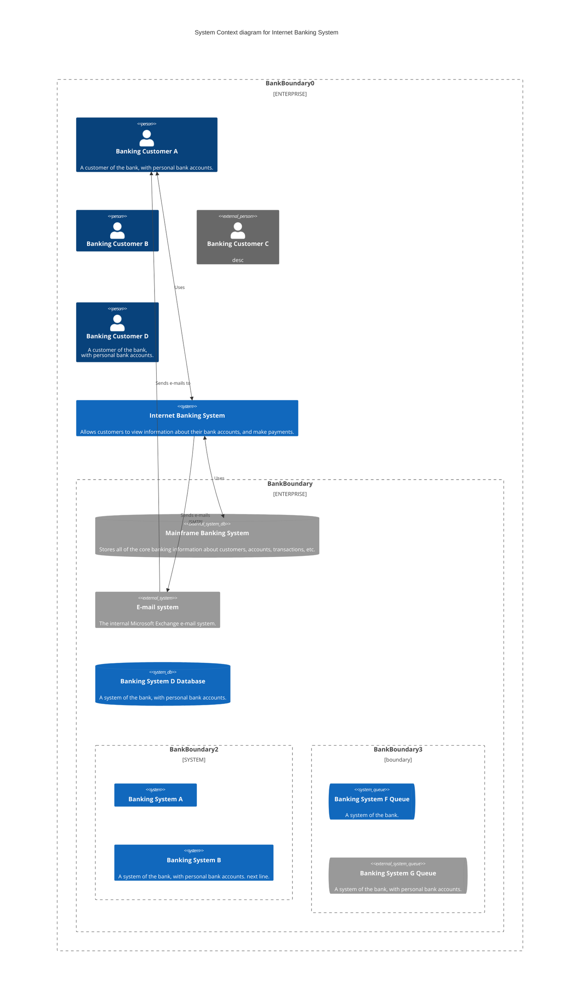
```mermaid
C4Context
    title System Context diagram for Internet Banking System
    Enterprise_Boundary(b0, "BankBoundary0") {
        Person(customerA, "Banking Customer A", "A customer of the bank, with personal bank accounts.")
        Person(customerB, "Banking Customer B")
        Person_Ext(customerC, "Banking Customer C", "desc")

        Person(customerD, "Banking Customer D", "A customer of the bank, <br/> with personal bank accounts.")

        System(SystemAA, "Internet Banking System", "Allows customers to view information about their bank accounts, and make payments.")

        Enterprise_Boundary(b1, "BankBoundary") {
            SystemDb_Ext(SystemE, "Mainframe Banking System", "Stores all of the core banking information about customers, accounts, transactions, etc.")

            System_Boundary(b2, "BankBoundary2") {
                System(SystemA, "Banking System A")
                System(SystemB, "Banking System B", "A system of the bank, with personal bank accounts. next line.")
            }

            System_Ext(SystemC, "E-mail system", "The internal Microsoft Exchange e-mail system.")
            SystemDb(SystemD, "Banking System D Database", "A system of the bank, with personal bank accounts.")

            Boundary(b3, "BankBoundary3", "boundary") {
                SystemQueue(SystemF, "Banking System F Queue", "A system of the bank.")
                SystemQueue_Ext(SystemG, "Banking System G Queue", "A system of the bank, with personal bank accounts.")
            }
        }
    }

    BiRel(customerA, SystemAA, "Uses")
    BiRel(SystemAA, SystemE, "Uses")
    Rel(SystemAA, SystemC, "Sends e-mails", "SMTP")
    Rel(SystemC, customerA, "Sends e-mails to")
```

## C4Container

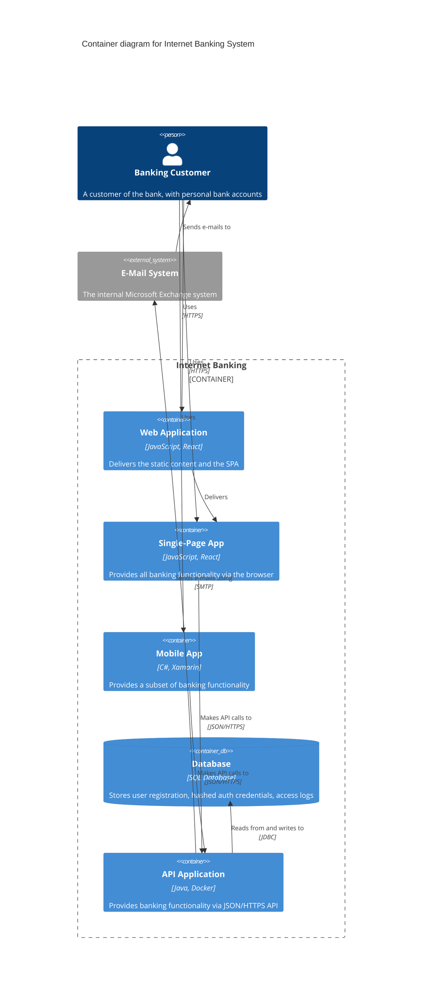
```mermaid
C4Container
    title Container diagram for Internet Banking System

    Person(customer, "Banking Customer", "A customer of the bank, with personal bank accounts")
    System_Ext(email_system, "E-Mail System", "The internal Microsoft Exchange system")

    Container_Boundary(c1, "Internet Banking") {
        Container(web_app, "Web Application", "JavaScript, React", "Delivers the static content and the SPA")
        Container(spa, "Single-Page App", "JavaScript, React", "Provides all banking functionality via the browser")
        Container(mobile_app, "Mobile App", "C#, Xamarin", "Provides a subset of banking functionality")
        ContainerDb(database, "Database", "SQL Database", "Stores user registration, hashed auth credentials, access logs")
        Container(backend_api, "API Application", "Java, Docker", "Provides banking functionality via JSON/HTTPS API")
    }

    Rel(customer, web_app, "Uses", "HTTPS")
    Rel(customer, spa, "Uses", "HTTPS")
    Rel(customer, mobile_app, "Uses")
    Rel(web_app, spa, "Delivers")
    Rel(spa, backend_api, "Makes API calls to", "JSON/HTTPS")
    Rel(mobile_app, backend_api, "Makes API calls to", "JSON/HTTPS")
    Rel(backend_api, database, "Reads from and writes to", "JDBC")
    Rel(email_system, customer, "Sends e-mails to")
    Rel(backend_api, email_system, "Sends e-mails using", "SMTP")
```

## ishikawa-beta

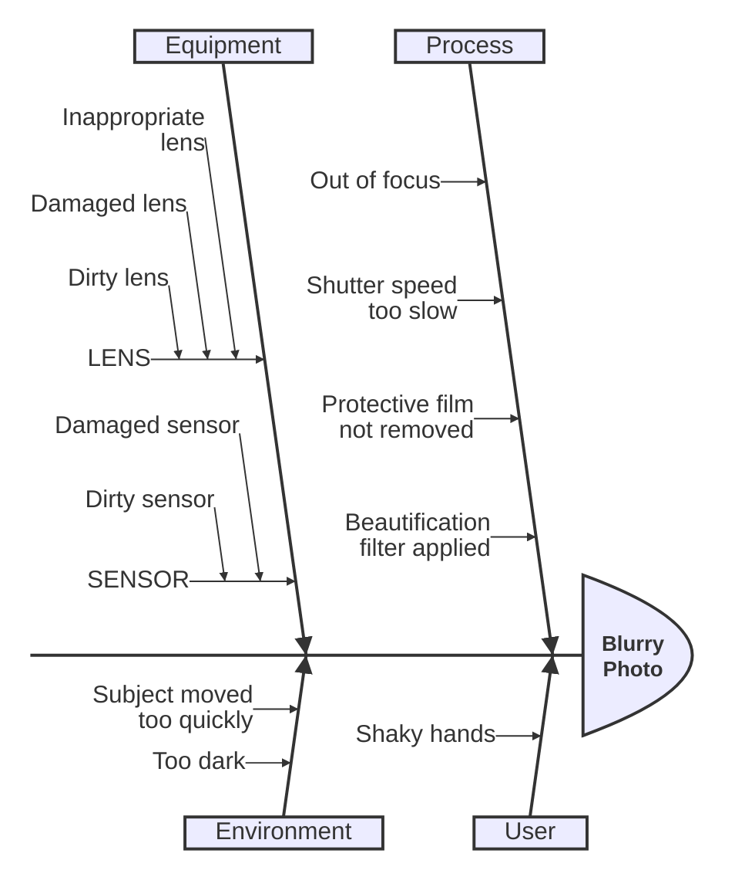
```mermaid

ishikawa-beta
    Blurry Photo
    Process
        Out of focus
        Shutter speed too slow
        Protective film not removed
        Beautification filter applied
    User
        Shaky hands
    Equipment
        LENS
            Inappropriate lens
            Damaged lens
            Dirty lens
        SENSOR
            Damaged sensor
            Dirty sensor
    Environment
        Subject moved too quickly
        Too dark

```

## kanban

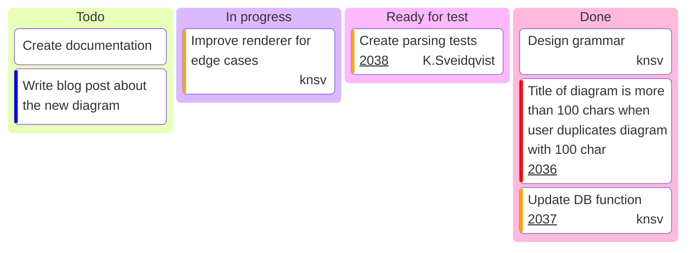
```mermaid
---
config:
  kanban:
    ticketBaseUrl: 'https://github.com/mermaid-js/mermaid/issues/#TICKET#'
---
kanban
  todo[Todo]
    docs[Create documentation]
    blog[Write blog post about the new diagram]@{ priority: 'Low' }
  inProgress[In progress]
    renderer[Improve renderer for edge cases]@{ assigned: 'knsv', priority: 'High' }
  readyForTest[Ready for test]
    parserTests[Create parsing tests]@{ ticket: 2038, assigned: 'K.Sveidqvist', priority: 'High' }
  done[Done]
    grammar[Design grammar]@{ assigned: 'knsv' }
    longTitle[Title of diagram is more than 100 chars when user duplicates diagram with 100 char]@{ ticket: 2036, priority: 'Very High' }
    dbFunction[Update DB function]@{ ticket: 2037, assigned: 'knsv', priority: 'High' }
```

## classDiagram

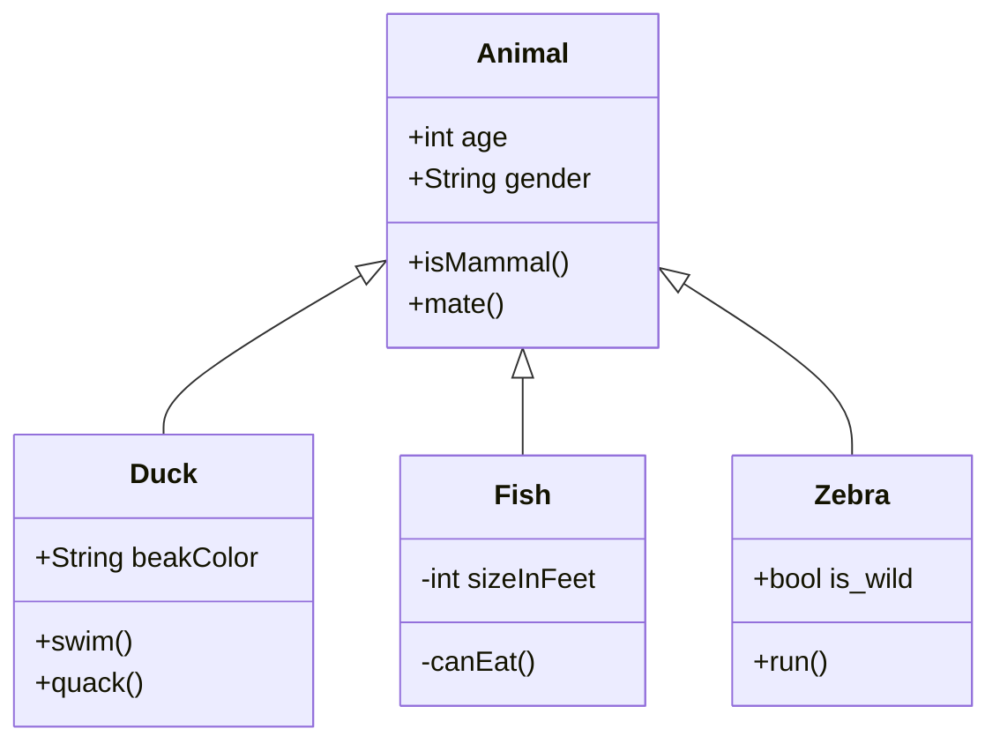
```mermaid
classDiagram
    Animal <|-- Duck
    Animal <|-- Fish
    Animal <|-- Zebra
    Animal : +int age
    Animal : +String gender
    Animal: +isMammal()
    Animal: +mate()
    class Duck{
      +String beakColor
      +swim()
      +quack()
    }
    class Fish{
      -int sizeInFeet
      -canEat()
    }
    class Zebra{
      +bool is_wild
      +run()
    }
```

## sequenceDiagram

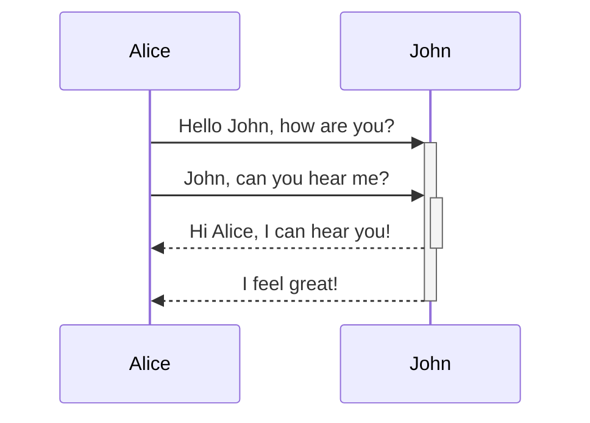
```mermaid
sequenceDiagram
    Alice->>+John: Hello John, how are you?
    Alice->>+John: John, can you hear me?
    John-->>-Alice: Hi Alice, I can hear you!
    John-->>-Alice: I feel great!
```

## pie

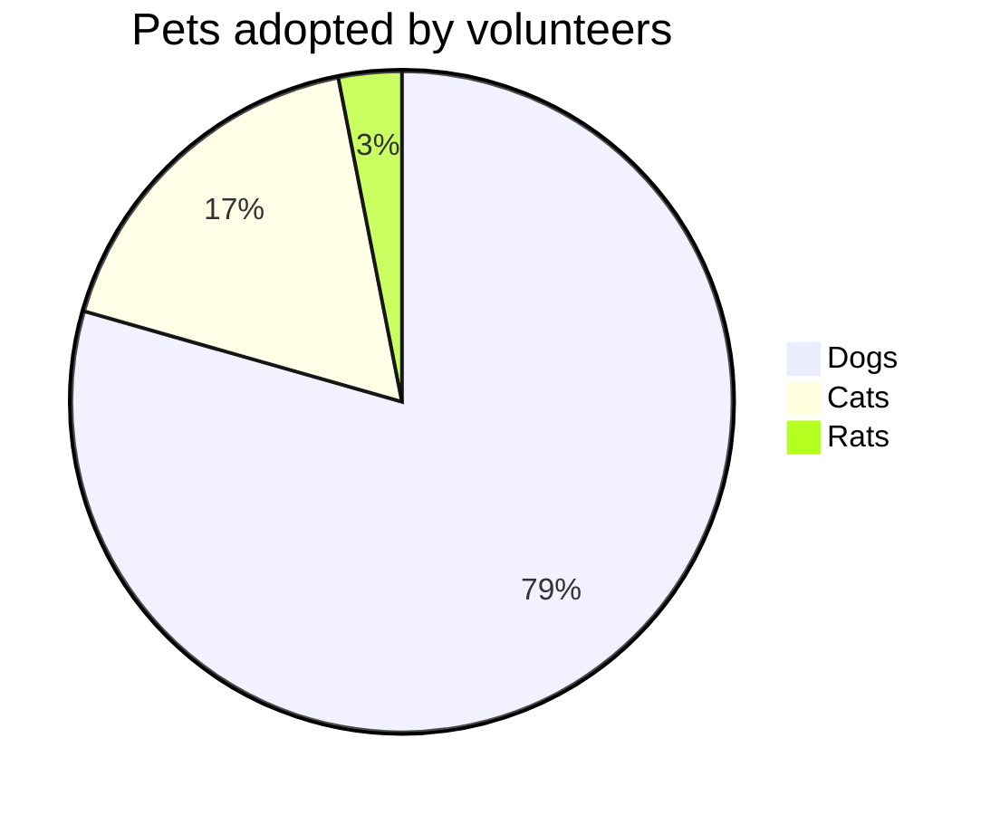
```mermaid
pie title Pets adopted by volunteers
    "Dogs" : 386
    "Cats" : 85
    "Rats" : 15
```

## journey

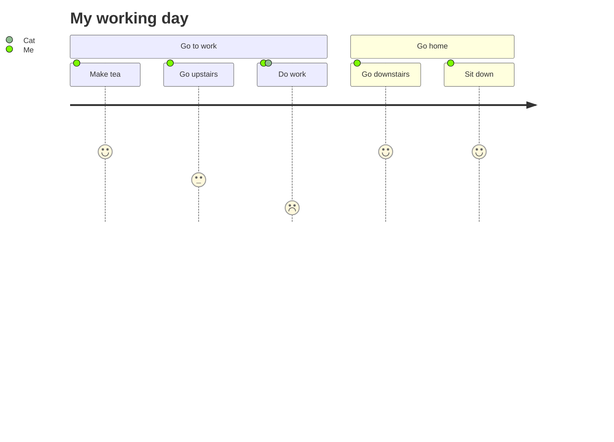
```mermaid
journey
    title My working day
    section Go to work
      Make tea: 5: Me
      Go upstairs: 3: Me
      Do work: 1: Me, Cat
    section Go home
      Go downstairs: 5: Me
      Sit down: 5: Me
```

## mindmap

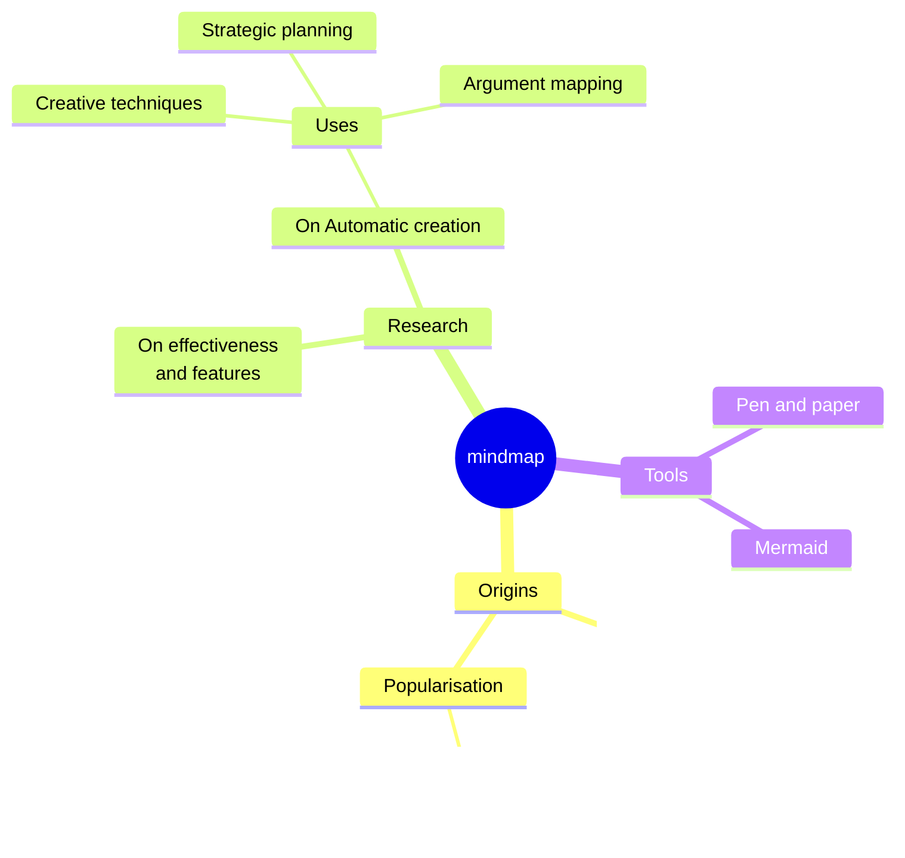
```mermaid
mindmap
  root((mindmap))
    Origins
      Long history
      ::icon(fa fa-book)
      Popularisation
        British popular psychology author Tony Buzan
    Research
      On effectiveness<br/>and features
      On Automatic creation
        Uses
            Creative techniques
            Strategic planning
            Argument mapping
    Tools
      Pen and paper
      Mermaid
```

## requirementDiagram

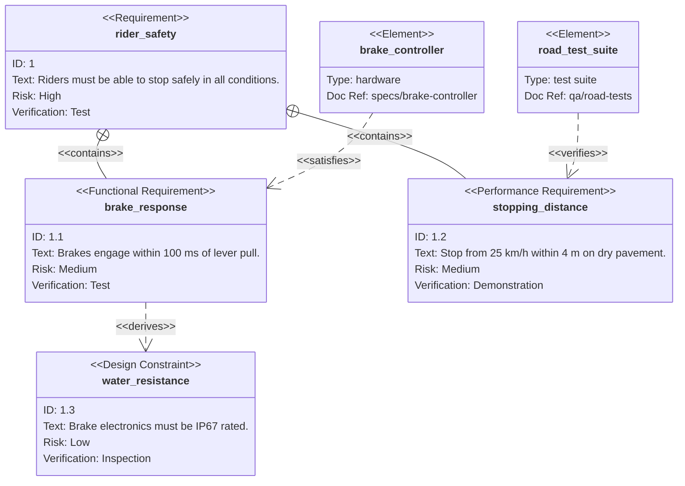
```mermaid
requirementDiagram

    requirement rider_safety {
        id: 1
        text: Riders must be able to stop safely in all conditions.
        risk: high
        verifymethod: test
    }

    functionalRequirement brake_response {
        id: 1.1
        text: Brakes engage within 100 ms of lever pull.
        risk: medium
        verifymethod: test
    }

    performanceRequirement stopping_distance {
        id: 1.2
        text: Stop from 25 km/h within 4 m on dry pavement.
        risk: medium
        verifymethod: demonstration
    }

    designConstraint water_resistance {
        id: 1.3
        text: Brake electronics must be IP67 rated.
        risk: low
        verifymethod: inspection
    }

    element brake_controller {
        type: hardware
        docRef: "specs/brake-controller"
    }

    element road_test_suite {
        type: "test suite"
        docRef: "qa/road-tests"
    }

    rider_safety - contains -> brake_response
    rider_safety - contains -> stopping_distance
    brake_response - derives -> water_resistance
    brake_controller - satisfies -> brake_response
    road_test_suite - verifies -> stopping_distance
```

## radar-beta

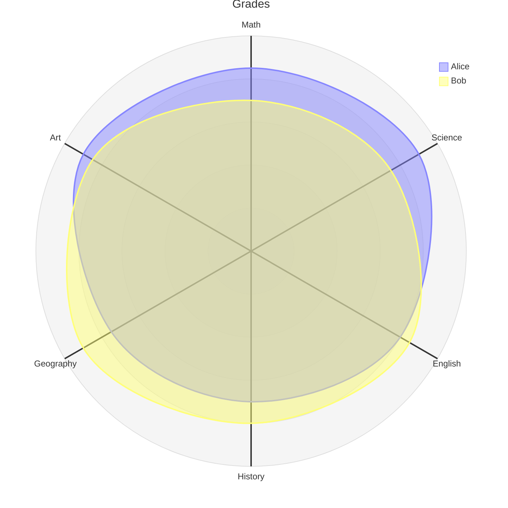
```mermaid
---
title: "Grades"
---
radar-beta
  axis m["Math"], s["Science"], e["English"]
  axis h["History"], g["Geography"], a["Art"]
  curve a["Alice"]{85, 90, 80, 70, 75, 90}
  curve b["Bob"]{70, 75, 85, 80, 90, 85}

  max 100
  min 0

```

## stateDiagram-v2

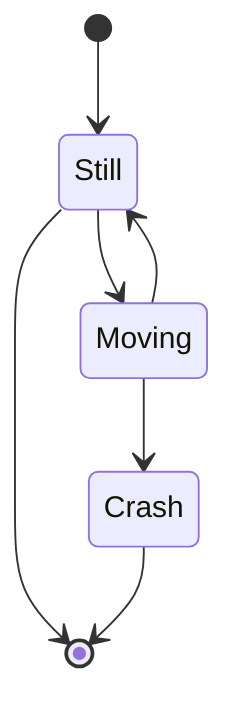
```mermaid
stateDiagram-v2
    [*] --> Still
    Still --> [*]
    Still --> Moving
    Moving --> Still
    Moving --> Crash
    Crash --> [*]
```

## erDiagram

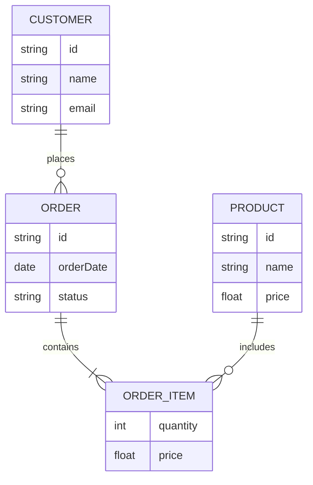
```mermaid
erDiagram
    CUSTOMER ||--o{ ORDER : places
    ORDER ||--|{ ORDER_ITEM : contains
    PRODUCT ||--o{ ORDER_ITEM : includes
    CUSTOMER {
        string id
        string name
        string email
    }
    ORDER {
        string id
        date orderDate
        string status
    }
    PRODUCT {
        string id
        string name
        float price
    }
    ORDER_ITEM {
        int quantity
        float price
    }
```

## gitGraph

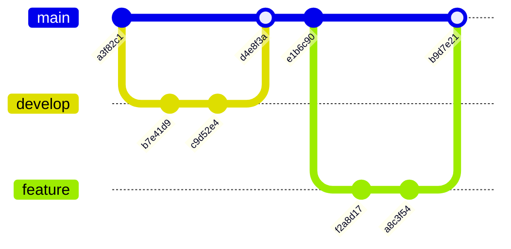
```mermaid
gitGraph
    commit id: "a3f82c1"
    branch develop
    checkout develop
    commit id: "b7e41d9"
    commit id: "c9d52e4"
    checkout main
    merge develop id: "d4e8f3a"
    commit id: "e1b6c90"
    branch feature
    checkout feature
    commit id: "f2a8d17"
    commit id: "a8c3f54"
    checkout main
    merge feature id: "b9d7e21"
```

## architecture-beta

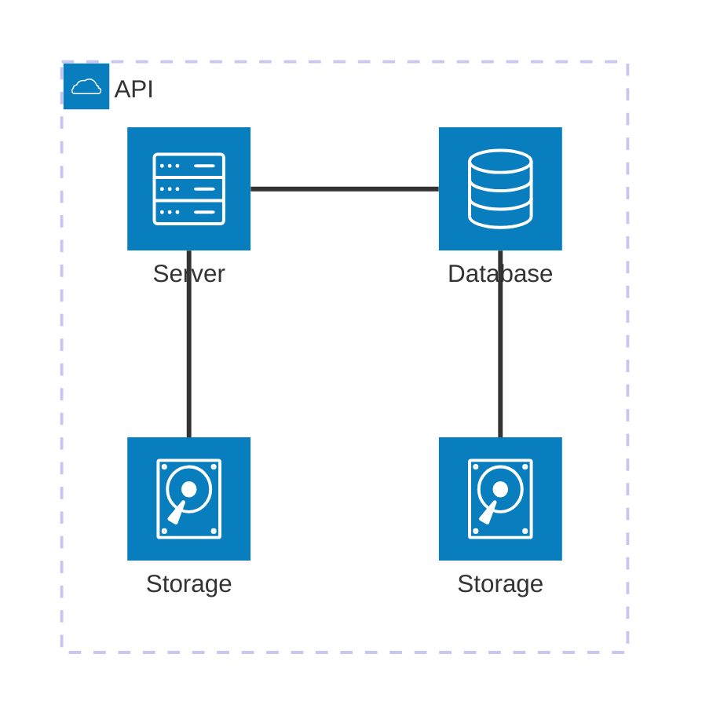
```mermaid
architecture-beta
    group api(cloud)[API]

    service db(database)[Database] in api
    service disk1(disk)[Storage] in api
    service disk2(disk)[Storage] in api
    service server(server)[Server] in api

    db:L -- R:server
    disk1:T -- B:server
    disk2:T -- B:db
```

## xychart-beta

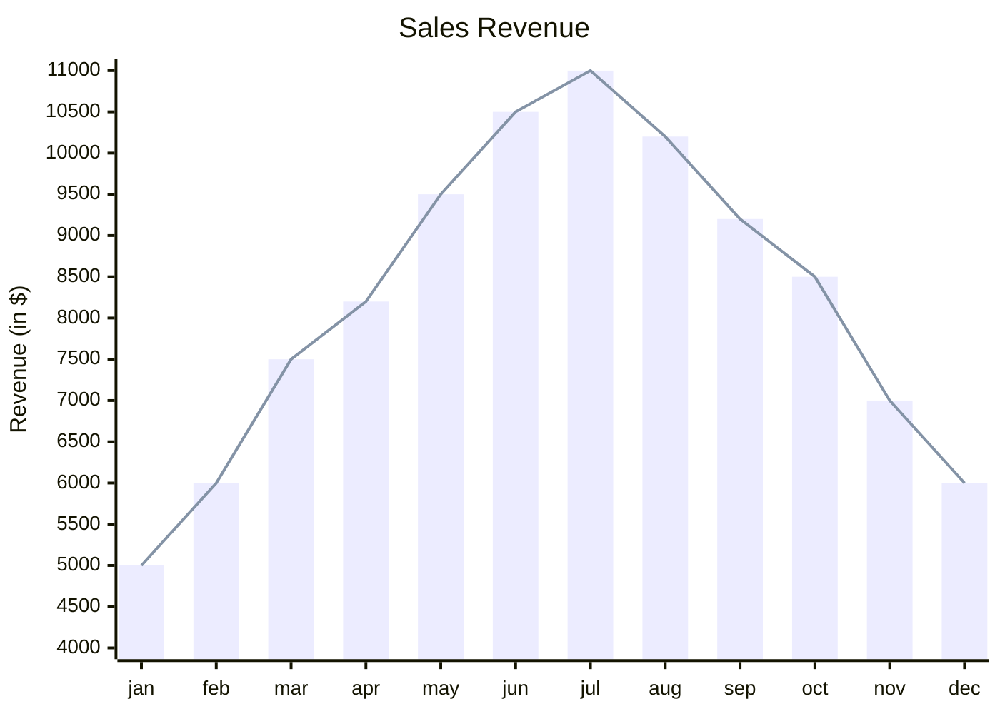
```mermaid
xychart-beta
    title "Sales Revenue"
    x-axis [jan, feb, mar, apr, may, jun, jul, aug, sep, oct, nov, dec]
    y-axis "Revenue (in $)" 4000 --> 11000
    bar [5000, 6000, 7500, 8200, 9500, 10500, 11000, 10200, 9200, 8500, 7000, 6000]
    line [5000, 6000, 7500, 8200, 9500, 10500, 11000, 10200, 9200, 8500, 7000, 6000]
```

## sankey-beta

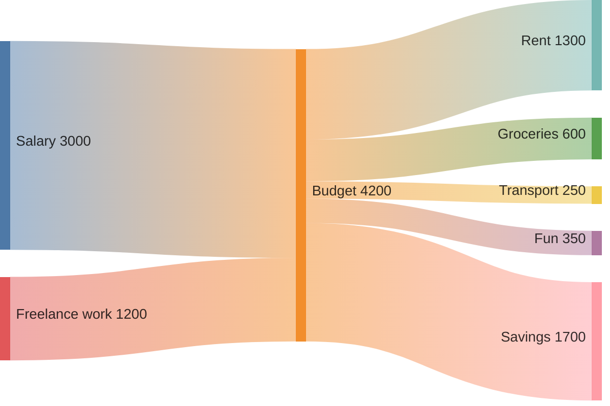
```mermaid
sankey-beta

Salary,Budget,3000
Freelance work,Budget,1200
Budget,Rent,1300
Budget,Groceries,600
Budget,Transport,250
Budget,Fun,350
Budget,Savings,1700
```

## gantt

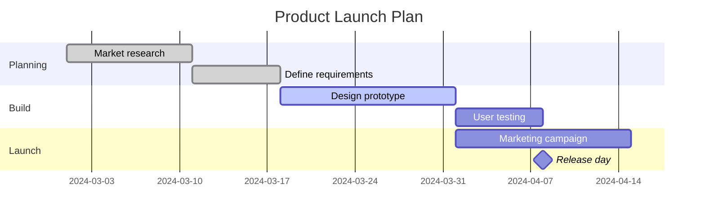
```mermaid
gantt
    title Product Launch Plan
    dateFormat YYYY-MM-DD
    section Planning
        Market research      :done, research, 2024-03-01, 10d
        Define requirements  :done, reqs, after research, 7d
    section Build
        Design prototype     :active, proto, after reqs, 14d
        User testing         :testing, after proto, 7d
    section Launch
        Marketing campaign   :marketing, after proto, 14d
        Release day          :milestone, after testing, 0d
```

## timeline

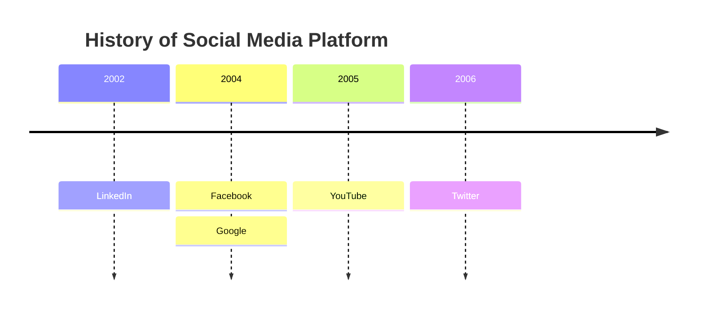
```mermaid
timeline
    title History of Social Media Platform
    2002 : LinkedIn
    2004 : Facebook
         : Google
    2005 : YouTube
    2006 : Twitter
```

## quadrantChart

```mermaid
quadrantChart
    title Reach and engagement of campaigns
    x-axis Low Reach --> High Reach
    y-axis Low Engagement --> High Engagement
    quadrant-1 We should expand
    quadrant-2 Need to promote
    quadrant-3 Re-evaluate
    quadrant-4 May be improved
    Campaign A: [0.3, 0.6]
    Campaign B: [0.45, 0.23]
    Campaign C: [0.57, 0.69]
    Campaign D: [0.78, 0.34]
    Campaign E: [0.40, 0.34]
    Campaign F: [0.35, 0.78]
```

## packet

```mermaid
---
title: "TCP Packet"
---
packet
0-15: "Source Port"
16-31: "Destination Port"
32-63: "Sequence Number"
64-95: "Acknowledgment Number"
96-99: "Data Offset"
100-105: "Reserved"
106: "URG"
107: "ACK"
108: "PSH"
109: "RST"
110: "SYN"
111: "FIN"
112-127: "Window"
128-143: "Checksum"
144-159: "Urgent Pointer"
160-191: "(Options and Padding)"
192-255: "Data (variable length)"
```

## block-beta

```mermaid
block-beta
  columns 3
  user(("User")):3
  space:3
  ui["Web UI"] api["API Server"] db[("Database")]

  user --> ui
  ui --> api
  api --> db

  style user fill:#ffe0b2,stroke:#fb8c00
  style db fill:#bbdefb,stroke:#1e88e5
```

## treemap-beta

```mermaid
---
config:
  treemap:
    valueFormat: '$0,0'
---
treemap-beta
"Monthly Budget"
    "Housing"
        "Rent": 1400
        "Utilities": 220
        "Internet": 60
    "Food"
        "Groceries": 480
        "Dining out": 180
    "Transport"
        "Car payment": 320
        "Fuel": 140
    "Savings"
        "Emergency fund": 300
        "Retirement": 400
```

## usecase-beta

```mermaid
usecase-beta
actor User("User")
actor Admin("Administrator")
Login("Log in")
ViewProfile("View profile")
ManageUsers("Manage users")
ViewReports("View reports")
User --> Login
User --> ViewProfile
Admin --> ManageUsers
Admin --> ViewReports
```

## eventmodeling

```mermaid
eventmodeling

tf 01 ui ShopUI
tf 02 cmd AddItemToCart
tf 03 evt ItemAdded
tf 04 rmo CartView ->> 03
tf 05 ui CheckoutUI
tf 06 cmd PlaceOrder
tf 07 evt OrderPlaced
tf 08 rmo OrderStatus ->> 07

```

## venn-beta

```mermaid
venn-beta
    title "Finding the Product Sweet Spot"
    set Desirable
    set Feasible
    set Viable
    union Desirable,Feasible["Worth prototyping"]
    union Feasible,Viable["Cheap to run"]
    union Desirable,Viable["Hard to build"]
    union Desirable,Feasible,Viable["Sweet spot"]
```

## treeView-beta

```mermaid
treeView-beta
            my-project/
                src/
                    components/
                        Button.tsx
                        Header.tsx
                    App.tsx
                    index.js
                .gitignore
                package.json
                README.md
```

## wardley-beta

```mermaid
wardley-beta
title Tea Shop
size [1100, 800]

anchor Business [0.95, 0.63]
anchor Public [0.95, 0.78]
component Cup of Tea [0.79, 0.61] label [19, -4]
component Cup [0.73, 0.78]
component Tea [0.63, 0.81]
component Hot Water [0.52, 0.80]
component Water [0.38, 0.82]
component Kettle [0.43, 0.35] label [-57, 4]
component Power [0.1, 0.7] label [-27, 20]

Business -> Cup of Tea
Public -> Cup of Tea
Cup of Tea -> Cup
Cup of Tea -> Tea
Cup of Tea -> Hot Water
Hot Water -> Water
Hot Water -> Kettle
Kettle -> Power

evolve Kettle 0.62
evolve Power 0.89

note "Standardising power allows Kettles to evolve faster" [0.30, 0.49]
note "Hot water is obvious and well known" [0.48, 0.80]
note "A generic note appeared" [0.23, 0.33]

```

## cynefin-beta

```mermaid
cynefin-beta
  title Incident Response

  complex
    "Investigate root cause"
    "Run chaos experiment"

  complicated
    "Analyze performance data"
    "Expert review needed"

  clear
    "Restart service"
    "Apply known fix"

  chaotic
    "Page on-call immediately"

  confusion
    "Unknown failure mode"

  complex --> complicated : "Pattern identified"
  clear --> chaotic : "Complacency"

```

## railroad-beta

```mermaid
railroad-beta
    title Expression Grammar

    expression = sequence(
        nonterminal("term"),
        zeroOrMore(sequence(
            choice(terminal("+"), terminal("-")),
            nonterminal("term")
        ))
    ) ;
    term = sequence(
        nonterminal("factor"),
        zeroOrMore(sequence(
            choice(terminal("*"), terminal("/")),
            nonterminal("factor")
        ))
    ) ;
    factor = choice(
        nonterminal("number"),
        sequence(terminal("("), nonterminal("expression"), terminal(")"))
    ) ;
    number = oneOrMore(nonterminal("digit")) ;
    digit = choice(terminal("0"), terminal("1"), terminal("2"), terminal("3"), terminal("4"), terminal("5"), terminal("6"), terminal("7"), terminal("8"), terminal("9")) ;
```

## railroad-ebnf-beta

```mermaid
railroad-ebnf-beta
    title Expression Grammar

    expression = term ( "+" term | "-" term )* ;
    term = factor ( "*" factor | "/" factor )* ;
    factor = number | "(" expression ")" ;
    number = digit+ ;
    digit = "0" | "1" | "2" | "3" | "4" | "5" | "6" | "7" | "8" | "9" ;
```

## railroad-abnf-beta

```mermaid
railroad-abnf-beta
    title Email Address

    address = local-part "@" domain ;
    local-part = 1*( ALPHA / DIGIT / "." / "-" ) ;
    domain = label *( "." label ) ;
    label = 1*( ALPHA / DIGIT / "-" ) ;
```

## railroad-peg-beta

```mermaid
railroad-peg-beta
    title Calculator Grammar

    Expression <- Term (("+" / "-") Term)* ;
    Term <- Factor (("*" / "/") Factor)* ;
    Factor <- Number / "(" Expression ")" ;
    Number <- Digit+ ;
    Digit <- "0" / "1" / "2" / "3" / "4" / "5" / "6" / "7" / "8" / "9" ;
```

## info

```mermaid
info
```

## flowchart-elk

```mermaid
flowchart-elk TD
  a --> b
  a --> c
  b --> d
  c --> d
```

## block (no -beta)

```mermaid
block
  columns 3
  a b c
```

## architecture (no -beta)

```mermaid
architecture
  group api(cloud)[API]
  service db(database)[DB] in api
  service srv(server)[Server] in api
  db:L -- R:srv
```

## C4Component

```mermaid
C4Component
  title Comp
  Container_Boundary(b, "App") {
    Component(c1, "Ctrl", "Spring")
  }
```

## swimlane-beta

```mermaid
swimlane-beta LR
  subgraph Customer
    request[Request]
  end
  subgraph Support
    triage[Triage]
  end
  request --> triage
```

## agentflow-beta

```mermaid
agentflow-beta TB
  flow reviewer["Review Agent"]
    changes["Gather"]@{ shape: input }
    lint["run_linter"]@{ shape: tool }
    changes --> lint
  end
```

