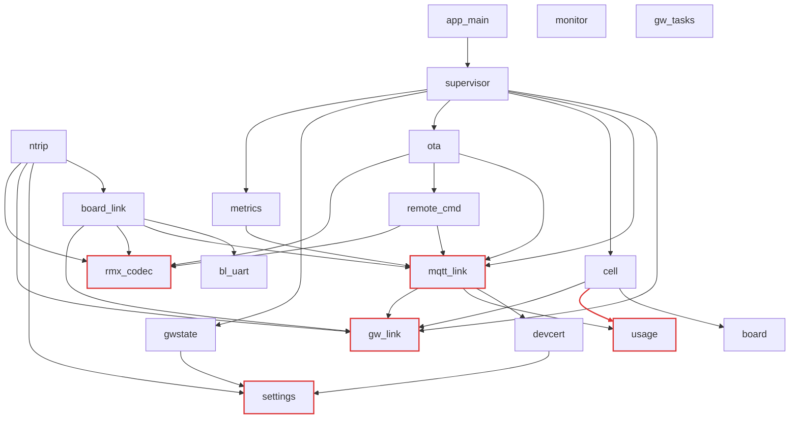
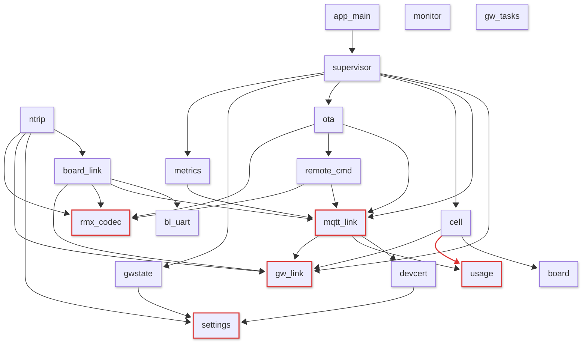
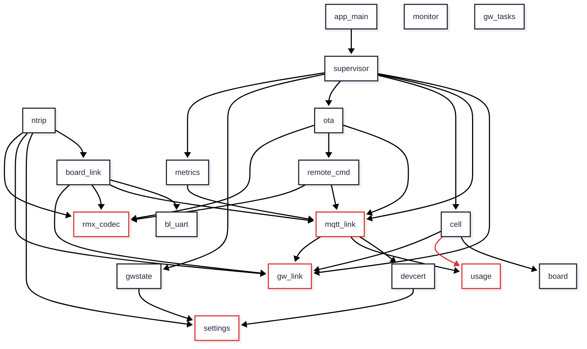
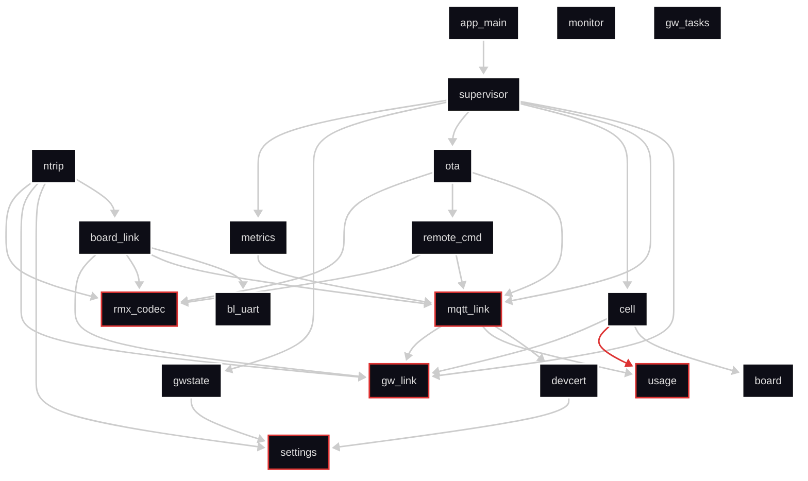

# Organigram themes and looks

## 1. current (no config)

```mermaid
flowchart TD
  n_app_main["app_main"]
  n_supervisor["supervisor"]
  n_mqtt_link["mqtt_link"]
  n_board_link["board_link"]
  n_ntrip["ntrip"]
  n_remote_cmd["remote_cmd"]
  n_ota["ota"]
  n_gwstate["gwstate"]
  n_metrics["metrics"]
  n_monitor["monitor"]
  n_usage["usage"]
  n_devcert["devcert"]
  n_rmx_codec["rmx_codec"]
  n_cell["cell"]
  n_bl_uart["bl_uart"]
  n_board["board"]
  n_settings["settings"]
  n_gw_tasks["gw_tasks"]
  n_gw_link["gw_link"]
  n_app_main --> n_supervisor
  n_supervisor --> n_gw_link
  n_supervisor --> n_mqtt_link
  n_supervisor --> n_cell
  n_supervisor --> n_ota
  n_supervisor --> n_gwstate
  n_supervisor --> n_metrics
  n_mqtt_link --> n_devcert
  n_mqtt_link --> n_usage
  n_mqtt_link --> n_gw_link
  n_board_link --> n_bl_uart
  n_board_link --> n_mqtt_link
  n_board_link --> n_rmx_codec
  n_board_link --> n_gw_link
  n_ntrip --> n_board_link
  n_ntrip --> n_settings
  n_ntrip --> n_gw_link
  n_ntrip --> n_rmx_codec
  n_remote_cmd --> n_mqtt_link
  n_remote_cmd --> n_rmx_codec
  n_ota --> n_mqtt_link
  n_ota --> n_remote_cmd
  n_ota --> n_rmx_codec
  n_gwstate --> n_settings
  n_metrics --> n_mqtt_link
  n_devcert --> n_settings
  n_cell --> n_board
  n_cell --> n_usage
  n_cell --> n_gw_link
  classDef shared stroke:#d33,stroke-width:2px
  class n_gw_link,n_mqtt_link,n_usage,n_rmx_codec,n_settings shared
  linkStyle 27 stroke:#d33,stroke-width:2px
```

## 2. look: neo

```mermaid
---
config:
  look: neo
---
flowchart TD
  n_app_main["app_main"]
  n_supervisor["supervisor"]
  n_mqtt_link["mqtt_link"]
  n_board_link["board_link"]
  n_ntrip["ntrip"]
  n_remote_cmd["remote_cmd"]
  n_ota["ota"]
  n_gwstate["gwstate"]
  n_metrics["metrics"]
  n_monitor["monitor"]
  n_usage["usage"]
  n_devcert["devcert"]
  n_rmx_codec["rmx_codec"]
  n_cell["cell"]
  n_bl_uart["bl_uart"]
  n_board["board"]
  n_settings["settings"]
  n_gw_tasks["gw_tasks"]
  n_gw_link["gw_link"]
  n_app_main --> n_supervisor
  n_supervisor --> n_gw_link
  n_supervisor --> n_mqtt_link
  n_supervisor --> n_cell
  n_supervisor --> n_ota
  n_supervisor --> n_gwstate
  n_supervisor --> n_metrics
  n_mqtt_link --> n_devcert
  n_mqtt_link --> n_usage
  n_mqtt_link --> n_gw_link
  n_board_link --> n_bl_uart
  n_board_link --> n_mqtt_link
  n_board_link --> n_rmx_codec
  n_board_link --> n_gw_link
  n_ntrip --> n_board_link
  n_ntrip --> n_settings
  n_ntrip --> n_gw_link
  n_ntrip --> n_rmx_codec
  n_remote_cmd --> n_mqtt_link
  n_remote_cmd --> n_rmx_codec
  n_ota --> n_mqtt_link
  n_ota --> n_remote_cmd
  n_ota --> n_rmx_codec
  n_gwstate --> n_settings
  n_metrics --> n_mqtt_link
  n_devcert --> n_settings
  n_cell --> n_board
  n_cell --> n_usage
  n_cell --> n_gw_link
  classDef shared stroke:#d33,stroke-width:2px
  class n_gw_link,n_mqtt_link,n_usage,n_rmx_codec,n_settings shared
  linkStyle 27 stroke:#d33,stroke-width:2px
```

## 3. theme: redux-color, look: neo

```mermaid
---
config:
  theme: redux-color
  look: neo
---
flowchart TD
  n_app_main["app_main"]
  n_supervisor["supervisor"]
  n_mqtt_link["mqtt_link"]
  n_board_link["board_link"]
  n_ntrip["ntrip"]
  n_remote_cmd["remote_cmd"]
  n_ota["ota"]
  n_gwstate["gwstate"]
  n_metrics["metrics"]
  n_monitor["monitor"]
  n_usage["usage"]
  n_devcert["devcert"]
  n_rmx_codec["rmx_codec"]
  n_cell["cell"]
  n_bl_uart["bl_uart"]
  n_board["board"]
  n_settings["settings"]
  n_gw_tasks["gw_tasks"]
  n_gw_link["gw_link"]
  n_app_main --> n_supervisor
  n_supervisor --> n_gw_link
  n_supervisor --> n_mqtt_link
  n_supervisor --> n_cell
  n_supervisor --> n_ota
  n_supervisor --> n_gwstate
  n_supervisor --> n_metrics
  n_mqtt_link --> n_devcert
  n_mqtt_link --> n_usage
  n_mqtt_link --> n_gw_link
  n_board_link --> n_bl_uart
  n_board_link --> n_mqtt_link
  n_board_link --> n_rmx_codec
  n_board_link --> n_gw_link
  n_ntrip --> n_board_link
  n_ntrip --> n_settings
  n_ntrip --> n_gw_link
  n_ntrip --> n_rmx_codec
  n_remote_cmd --> n_mqtt_link
  n_remote_cmd --> n_rmx_codec
  n_ota --> n_mqtt_link
  n_ota --> n_remote_cmd
  n_ota --> n_rmx_codec
  n_gwstate --> n_settings
  n_metrics --> n_mqtt_link
  n_devcert --> n_settings
  n_cell --> n_board
  n_cell --> n_usage
  n_cell --> n_gw_link
  classDef shared stroke:#d33,stroke-width:2px
  class n_gw_link,n_mqtt_link,n_usage,n_rmx_codec,n_settings shared
  linkStyle 27 stroke:#d33,stroke-width:2px
```

## 4. theme: redux-dark-color, look: neo

```mermaid
---
config:
  theme: redux-dark-color
  look: neo
---
flowchart TD
  n_app_main["app_main"]
  n_supervisor["supervisor"]
  n_mqtt_link["mqtt_link"]
  n_board_link["board_link"]
  n_ntrip["ntrip"]
  n_remote_cmd["remote_cmd"]
  n_ota["ota"]
  n_gwstate["gwstate"]
  n_metrics["metrics"]
  n_monitor["monitor"]
  n_usage["usage"]
  n_devcert["devcert"]
  n_rmx_codec["rmx_codec"]
  n_cell["cell"]
  n_bl_uart["bl_uart"]
  n_board["board"]
  n_settings["settings"]
  n_gw_tasks["gw_tasks"]
  n_gw_link["gw_link"]
  n_app_main --> n_supervisor
  n_supervisor --> n_gw_link
  n_supervisor --> n_mqtt_link
  n_supervisor --> n_cell
  n_supervisor --> n_ota
  n_supervisor --> n_gwstate
  n_supervisor --> n_metrics
  n_mqtt_link --> n_devcert
  n_mqtt_link --> n_usage
  n_mqtt_link --> n_gw_link
  n_board_link --> n_bl_uart
  n_board_link --> n_mqtt_link
  n_board_link --> n_rmx_codec
  n_board_link --> n_gw_link
  n_ntrip --> n_board_link
  n_ntrip --> n_settings
  n_ntrip --> n_gw_link
  n_ntrip --> n_rmx_codec
  n_remote_cmd --> n_mqtt_link
  n_remote_cmd --> n_rmx_codec
  n_ota --> n_mqtt_link
  n_ota --> n_remote_cmd
  n_ota --> n_rmx_codec
  n_gwstate --> n_settings
  n_metrics --> n_mqtt_link
  n_devcert --> n_settings
  n_cell --> n_board
  n_cell --> n_usage
  n_cell --> n_gw_link
  classDef shared stroke:#d33,stroke-width:2px
  class n_gw_link,n_mqtt_link,n_usage,n_rmx_codec,n_settings shared
  linkStyle 27 stroke:#d33,stroke-width:2px
```

